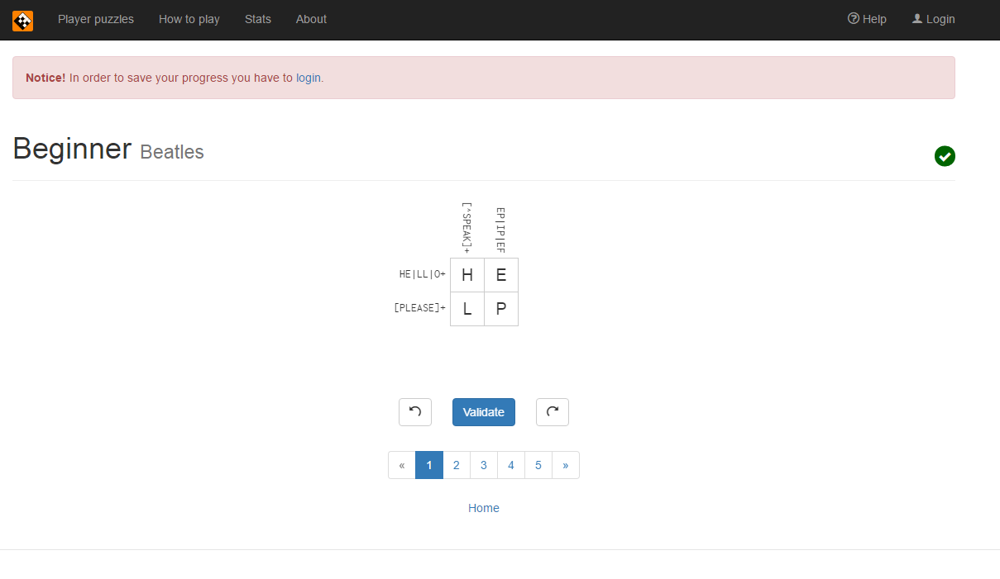

#Lab 1

### c. Reading assignments
	2. Suggestions for How To Answer Questions in a Helpful Way
		- Think of the question in asker's perspective.
		- Read over your answer again to make sure if you're not missing anything.
	3. First, I want to point out that the work that Jesse Jordan has done
	   is tremendous. He spent his time and energy for the purpose of improving
	   the search engine on his institution. As a current RPI student, this is something
	   that I can be proud of my institution and alumni. Although what RIAA has done to him
	   and what he went through was absurd, it also makes me think why he did not initially
	   state that it is not his responsibilities on his search engine. Google and other 
	   big search engine companies goes around the possible lawsuits because they initially
	   set up their agreements on illegal files being shared through the search engines
	   and restrict them as much as possible. This case reminds me that you can ruin my own
	   life easily no matter what the purpose is about.
	   
### d. Linux
3. 

### e. Regex
2. 
	 
3. 

### f. Play with Snap or CSDT or Blockly
2. 

### g. Reflection
3. These activities were quiet interesting. Honestly, it was more like solving puzzles.
   I do not quiet see the purpose behind these activities yet but I liked how these activities
   had logic and coding stuff. I really look forward to learn more about open source and
   be involved in a project and a program that I am really interested in.
