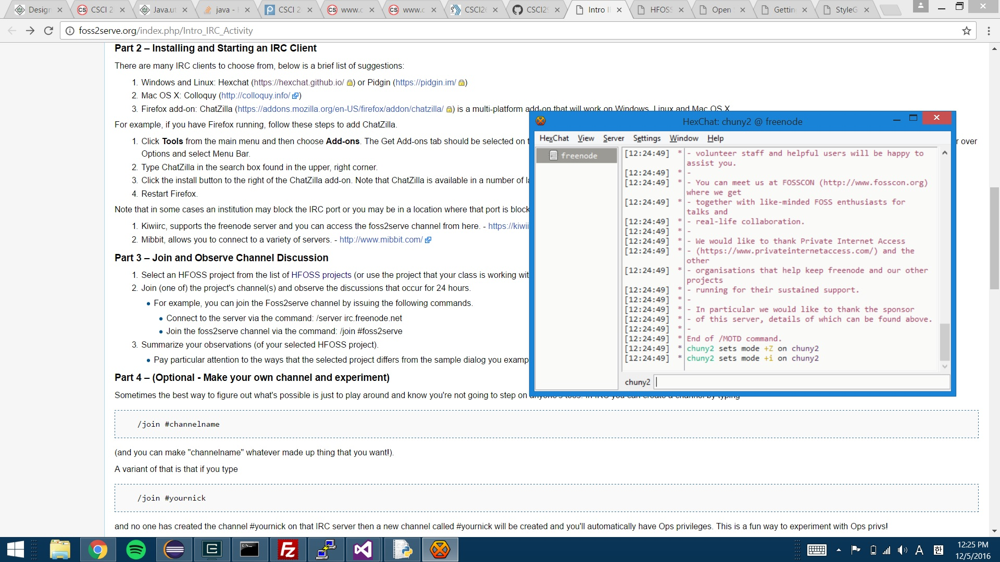
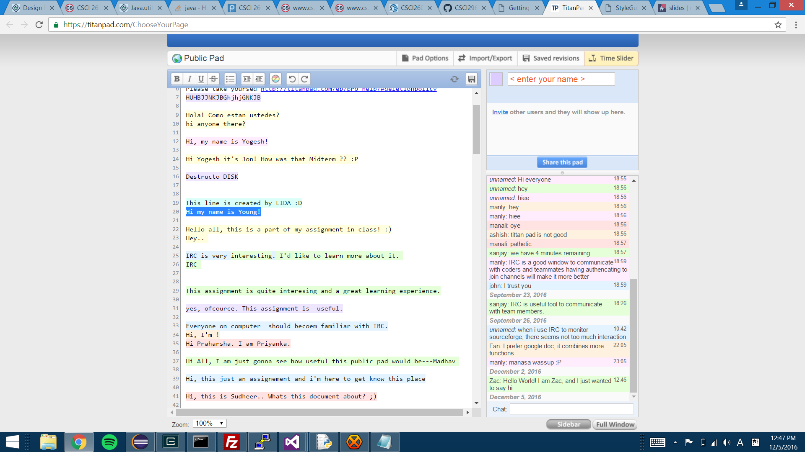

##First part
>

##Second part
> 1. I have observed few hour long discussion between random users about their project. Most part, I could not understand the high level of their project but I was able to understand
	their programming language was C++. They seemed to be working at their own open source project. They interact in this context just like they would interact in real life. I noticed 
	that the pattern of communication was very formal and polite but it was not far different then normal communication in real life.
2. 
4. Synchronous and asynchronous transmissions are two different methods of 
	transmission synchronization. Synchronous transmissions are synchronized by 
	an external clock, while asynchronous transmissions are synchronized by special 
	signals along the transmission medium.
	Social concern can be raised by collaborative software when few people have
	different perspectives on same project so that it will be hard to collaborate
	with each other.
	HCI issues can be raised when HCI is not fully embodying human intention.
	There can be errors between what HCI actually does and what the user actually
	meant to do.

##Third part
###Name : YoungChul Chun
###Website : www.weirdtube.wtf
###Description : Streaming website of weird videos
###Project Goal : For entertainment
###Communication Modes : www.weirdtube.wtf
###                      https://github.com/mmetro/WeirdSideofYouTube

##Forth part
>I think that standard coding is definitely necessary because in a work environment,
	lots of people code in a same project and sometimes issues can be raise understanding	
	each other's code. That's when standard code is needed so that there won't be any confusion
	by having rules that everyone should follow.	