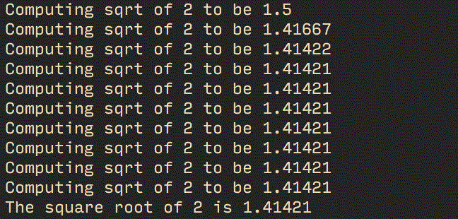
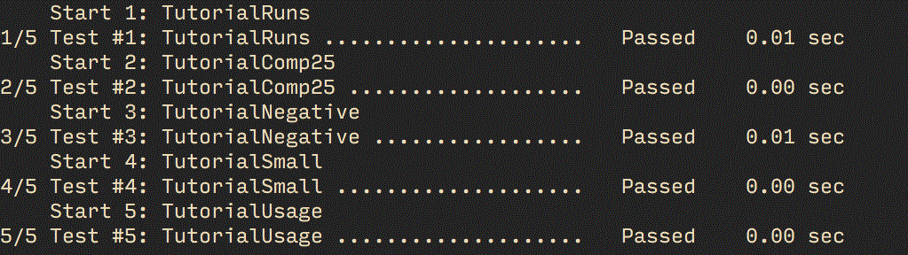
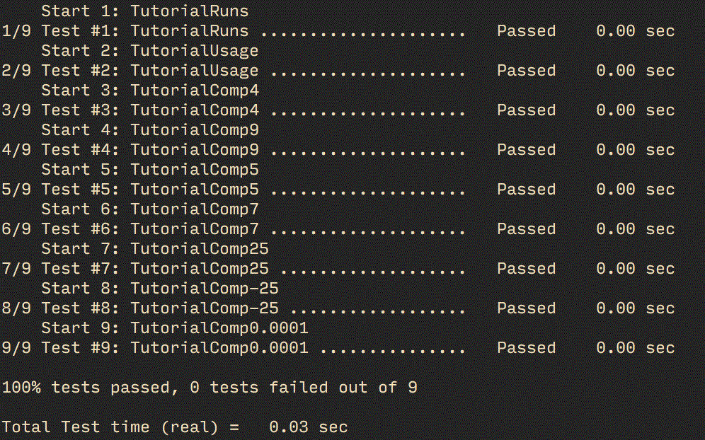

#Lab 5

##Step 1

###CMakeLists.txt
```
cmake_minimum_required (VERSION 2.6)
project (Tutorial)
# The version number.
set (Tutorial_VERSION_MAJOR 1)
set (Tutorial_VERSION_MINOR 0)

# configure a header file to pass some of the CMake settings
# to the source code
configure_file (
  "${PROJECT_SOURCE_DIR}/TutorialConfig.h.in"
  "${PROJECT_BINARY_DIR}/TutorialConfig.h"
  )

# add the binary tree to the search path for include files
# so that we will find TutorialConfig.h
include_directories("${PROJECT_BINARY_DIR}")

# add the executable
add_executable(Tutorial tutorial.cxx)
```

###TutorialConfig.h.in
```
// the configured options and settings for Tutorial
#define Tutorial_VERSION_MAJOR @Tutorial_VERSION_MAJOR@
#define Tutorial_VERSION_MINOR @Tutorial_VERSION_MINOR@
```

###tutorial.cxx
```
// A simple program that computes the square root of a number
#include <stdio.h>
#include <stdlib.h>
#include <math.h>
#include "TutorialConfig.h"

int main (int argc, char *argv[])
{
	if (argc < 2)
	{
		fprintf(stdout,"%s Version %d.%d\n",
            argv[0],
            Tutorial_VERSION_MAJOR,
            Tutorial_VERSION_MINOR);
		fprintf(stdout,"Usage: %s number\n",argv[0]);
		return 1;
	}
	double inputValue = atof(argv[1]);
	double outputValue = sqrt(inputValue);
	fprintf(stdout,"The square root of %g is %g\n", inputValue, outputValue);
	return 0;
}
```

###result


##Step 2

###CMakeLists.txt - MathFunctions
```
add_library(MathFunctions mysqrt.cxx)
```

###CMakeLists.txt - root
```
cmake_minimum_required (VERSION 2.6)
project (Tutorial)
# The version number.
set (Tutorial_VERSION_MAJOR 1)
set (Tutorial_VERSION_MINOR 0)

# should we use our own math functions?
option (USE_MYMATH 
        "Use tutorial provided math implementation" ON) 

# configure a header file to pass some of the CMake settings
# to the source code
configure_file (
  "${PROJECT_SOURCE_DIR}/TutorialConfig.h.in"
  "${PROJECT_BINARY_DIR}/TutorialConfig.h"
  )

# add the binary tree to the search path for include files
# so that we will find TutorialConfig.h
include_directories("${PROJECT_BINARY_DIR}")

# add the MathFunctions library?
if (USE_MYMATH)
  include_directories ("${PROJECT_SOURCE_DIR}/MathFunctions")
  add_subdirectory (MathFunctions)
  set (EXTRA_LIBS ${EXTRA_LIBS} MathFunctions)
endif (USE_MYMATH)
```

###TutorialConfig.h.in
```
// the configured options and settings for Tutorial
#cmakedefine USE_MYMATH
#define Tutorial_VERSION_MAJOR @Tutorial_VERSION_MAJOR@
#define Tutorial_VERSION_MINOR @Tutorial_VERSION_MINOR@
```

###tutorial.cxx
```
// A simple program that computes the square root of a number
#include <stdio.h>
#include <stdlib.h>
#include <math.h>
#include "TutorialConfig.h"
#include "mysqrt.cxx"

int main (int argc, char *argv[])
{
    if (argc < 2)
    {
        fprintf(stdout,"%s Version %d.%d\n",
            argv[0],
            Tutorial_VERSION_MAJOR,
            Tutorial_VERSION_MINOR);
        fprintf(stdout,"Usage: %s number\n",argv[0]);
        return 1;
    }
    double inputValue = atof(argv[1]);

    #ifdef USE_MYMATH
        double outputValue = mysqrt(inputValue);
    #else
        double outputValue = sqrt(inputValue);
    #endif

    fprintf(stdout,"The square root of %g is %g\n", inputValue, outputValue);
    return 0;
}
```

###mysqrt.cxx
```
double mysqrt(double x)
{
    return 555;
}
```
###result


##Step 3

###CMakeLists.txt - root
```
cmake_minimum_required (VERSION 2.6)
project (Tutorial)
# The version number.
set (Tutorial_VERSION_MAJOR 1)
set (Tutorial_VERSION_MINOR 0)

# should we use our own math functions?
option (USE_MYMATH 
        "Use tutorial provided math implementation" ON) 

# configure a header file to pass some of the CMake settings
# to the source code
configure_file (
  "${PROJECT_SOURCE_DIR}/TutorialConfig.h.in"
  "${PROJECT_BINARY_DIR}/TutorialConfig.h"
  )

# add the binary tree to the search path for include files
# so that we will find TutorialConfig.h
include_directories("${PROJECT_BINARY_DIR}")

# add the MathFunctions library?
if (USE_MYMATH)
  include_directories ("${PROJECT_SOURCE_DIR}/MathFunctions")
  add_subdirectory (MathFunctions)
  set (EXTRA_LIBS ${EXTRA_LIBS} MathFunctions)
endif (USE_MYMATH)

# add the executable
add_executable (Tutorial tutorial.cxx)
target_link_libraries (Tutorial  ${EXTRA_LIBS})


# add the install targets
install (TARGETS Tutorial DESTINATION bin)
install (FILES "${PROJECT_BINARY_DIR}/TutorialConfig.h"        
         DESTINATION include)


include(CTest)
#define a macro to simplify adding tests, then use it
macro (do_test arg result)
  add_test (TutorialComp${arg} Tutorial ${arg})
  set_tests_properties (TutorialComp${arg}
    PROPERTIES PASS_REGULAR_EXPRESSION ${result})
endmacro (do_test)

# do a bunch of result based tests
do_test (25 "25 is 5")
do_test (0 "0 is 0")
do_test (100 "100 is 10")
```

###CMakeLists.txt - MathFunctions
```
add_library(MathFunctions mysqrt.cxx)

install (TARGETS MathFunctions DESTINATION bin)
install (FILES MathFunctions.h DESTINATION include)
```
###result



##Step 4

###TutorialConfig.h.in
```
// the configured options and settings for Tutorial
#cmakedefine USE_MYMATH
#cmakedefine HAVE_LOG
#cmakedefine HAVE_EXP
#define Tutorial_VERSION_MAJOR @Tutorial_VERSION_MAJOR@
#define Tutorial_VERSION_MINOR @Tutorial_VERSION_MINOR@
```

###CMakeLists.txt - root
```
cmake_minimum_required (VERSION 2.6)
project (Tutorial)
# The version number.
set (Tutorial_VERSION_MAJOR 1)
set (Tutorial_VERSION_MINOR 0)

# should we use our own math functions?
option (USE_MYMATH 
        "Use tutorial provided math implementation" ON)

# does this system provide the log and exp functions?
include (CheckFunctionExists)
check_function_exists (log HAVE_LOG)
check_function_exists (exp HAVE_EXP) 

# configure a header file to pass some of the CMake settings
# to the source code
configure_file (
  "${PROJECT_SOURCE_DIR}/TutorialConfig.h.in"
  "${PROJECT_BINARY_DIR}/TutorialConfig.h"
  )

# add the binary tree to the search path for include files
# so that we will find TutorialConfig.h
include_directories("${PROJECT_BINARY_DIR}")

# add the MathFunctions library?
if (USE_MYMATH)
  include_directories ("${PROJECT_SOURCE_DIR}/MathFunctions")
  add_subdirectory (MathFunctions)
  set (EXTRA_LIBS ${EXTRA_LIBS} MathFunctions)
endif (USE_MYMATH)

# add the executable
add_executable (Tutorial tutorial.cxx)
target_link_libraries (Tutorial  ${EXTRA_LIBS})


# add the install targets
install (TARGETS Tutorial DESTINATION bin)
install (FILES "${PROJECT_BINARY_DIR}/TutorialConfig.h"        
         DESTINATION include)


include(CTest)
#define a macro to simplify adding tests, then use it
macro (do_test arg result)
  add_test (TutorialComp${arg} Tutorial ${arg})
  set_tests_properties (TutorialComp${arg}
    PROPERTIES PASS_REGULAR_EXPRESSION ${result})
endmacro (do_test)

# do a bunch of result based tests
do_test (25 "25 is 5")
do_test (0 "0 is 0")
do_test (100 "100 is 10")
```

###mysqrt.cxx
```
#include <math.h>

double mysqrt(double x)
{
// if we have both log and exp then use them
#if defined (HAVE_LOG) && defined (HAVE_EXP)
    return exp(log(x)*0.5);
#else // otherwise use an iterative approach
    return sqrt(x);
#endif
}
```

###result


##Step 5

###tutorial.cxx
```
// A simple program that computes the square root of a number
#include <stdio.h>
#include <stdlib.h>
#include <math.h>
#include "TutorialConfig.h"
#include "MathFunctions.h"

int main (int argc, char *argv[])
{
	if (argc < 2)
	{
		fprintf(stdout,"%s Version %d.%d\n",
            argv[0],
            Tutorial_VERSION_MAJOR,
            Tutorial_VERSION_MINOR);
		fprintf(stdout,"Usage: %s number\n",argv[0]);
		return 1;
	}
	double inputValue = atof(argv[1]);

	#ifdef USE_MYMATH
		double outputValue = mysqrt(inputValue);
	#else
		double outputValue = sqrt(inputValue);
	#endif

	fprintf(stdout,"The square root of %g is %g\n", inputValue, outputValue);
	return 0;
}
```

###TutorialConfig.h.in
```
// the configured options and settings for Tutorial
#define Tutorial_VERSION_MAJOR @Tutorial_VERSION_MAJOR@
#define Tutorial_VERSION_MINOR @Tutorial_VERSION_MINOR@
#cmakedefine USE_MYMATH
 
// does the platform provide exp and log functions?
#cmakedefine HAVE_LOG
#cmakedefine HAVE_EXP
```

###CMakeLists.txt - root
```
cmake_minimum_required (VERSION 2.6)
project (Tutorial)
include(CTest)
 
# The version number.
set (Tutorial_VERSION_MAJOR 1)
set (Tutorial_VERSION_MINOR 0)
 
# does this system provide the log and exp functions?
include (${CMAKE_ROOT}/Modules/CheckFunctionExists.cmake)
 
check_function_exists (log HAVE_LOG)
check_function_exists (exp HAVE_EXP)
 
# should we use our own math functions
option(USE_MYMATH 
  "Use tutorial provided math implementation" ON)
 
# configure a header file to pass some of the CMake settings
# to the source code
configure_file (
  "${PROJECT_SOURCE_DIR}/TutorialConfig.h.in"
  "${PROJECT_BINARY_DIR}/TutorialConfig.h"
  )
 
# add the binary tree to the search path for include files
# so that we will find TutorialConfig.h
include_directories ("${PROJECT_BINARY_DIR}")
 
# add the MathFunctions library?
if (USE_MYMATH)
  include_directories ("${PROJECT_SOURCE_DIR}/MathFunctions")
  add_subdirectory (MathFunctions)
  set (EXTRA_LIBS ${EXTRA_LIBS} MathFunctions)
endif (USE_MYMATH)
 
# add the executable
add_executable (Tutorial tutorial.cxx)
target_link_libraries (Tutorial  ${EXTRA_LIBS})
 
# add the install targets
install (TARGETS Tutorial DESTINATION bin)
install (FILES "${PROJECT_BINARY_DIR}/TutorialConfig.h"        
         DESTINATION include)
 
# does the application run
add_test (TutorialRuns Tutorial 25)
 
# does the usage message work?
add_test (TutorialUsage Tutorial)
set_tests_properties (TutorialUsage
  PROPERTIES 
  PASS_REGULAR_EXPRESSION "Usage:.*number"
  )
 
 
#define a macro to simplify adding tests
macro (do_test arg result)
  add_test (TutorialComp${arg} Tutorial ${arg})
  set_tests_properties (TutorialComp${arg}
    PROPERTIES PASS_REGULAR_EXPRESSION ${result}
    )
endmacro (do_test)
 
# do a bunch of result based tests
do_test (4 "4 is 2")
do_test (9 "9 is 3")
do_test (5 "5 is 2.236")
do_test (7 "7 is 2.645")
do_test (25 "25 is 5")
do_test (-25 "-25 is 0")
do_test (0.0001 "0.0001 is 0.01")
```

###CMakeLists.txt - MathFunctions
```
# first we add the executable that generates the table
add_executable(MakeTable MakeTable.cxx)
# add the command to generate the source code
add_custom_command (
  OUTPUT ${CMAKE_CURRENT_BINARY_DIR}/Table.h
  DEPENDS MakeTable
  COMMAND MakeTable ${CMAKE_CURRENT_BINARY_DIR}/Table.h
  )
# add the binary tree directory to the search path 
# for include files
include_directories( ${CMAKE_CURRENT_BINARY_DIR} )
 
# add the main library
add_library(MathFunctions mysqrt.cxx ${CMAKE_CURRENT_BINARY_DIR}/Table.h)
 
install (TARGETS MathFunctions DESTINATION bin)
install (FILES MathFunctions.h DESTINATION include)
```

###MakeTable.cxx
```
// A simple program that builds a sqrt table 
#include <stdio.h>
#include <stdlib.h>
#include <math.h>
 
int main (int argc, char *argv[])
{
  int i;
  double result;
 
  // make sure we have enough arguments
  if (argc < 2)
    {
    return 1;
    }
  
  // open the output file
  FILE *fout = fopen(argv[1],"w");
  if (!fout)
    {
    return 1;
    }
  
  // create a source file with a table of square roots
  fprintf(fout,"double sqrtTable[] = {\n");
  for (i = 0; i < 10; ++i)
    {
    result = sqrt(static_cast<double>(i));
    fprintf(fout,"%g,\n",result);
    }
 
  // close the table with a zero
  fprintf(fout,"0};\n");
  fclose(fout);
  return 0;
}
```

###MathFunctions.h
```
double mysqrt(double x);
```

###mysqrt.cxx
```
#include <math.h>

double mysqrt(double x)
{
// if we have both log and exp then use them
#if defined (HAVE_LOG) && defined (HAVE_EXP)
	return exp(log(x)*0.5);
#else // otherwise use an iterative approach
	return sqrt(x);
#endif
}
```

###result

